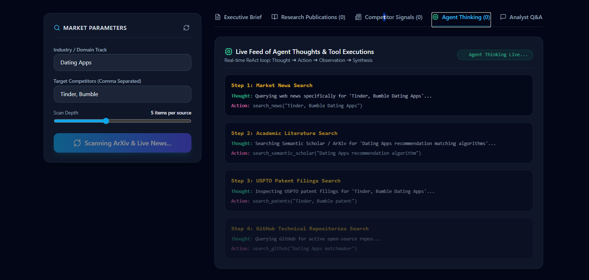

```
.-./`) ,---.   .--.,---------.    .-''-.    .---.     .-------.   ___    _   .---.       .-'''-.     .-''-.             ____    .-./`)         
\ .-.')|    \  |  |\          \ .'_ _   \   | ,_|     \  _(`)_ \.'   |  | |  | ,_|      / _     \  .'_ _   \          .'  __ `. \ .-.')        
/ `-' \|  ,  \ |  | `--.  ,---'/ ( ` )   ',-./  )     | (_ o._)||   .'  | |,-./  )     (`' )/`--' / ( ` )   '        /   '  \  \/ `-' \        
 `-'`"`|  |\_ \|  |    |   \  . (_ o _)  |\  '_ '`)   |  (_,_) /.'  '_  | |\  '_ '`)  (_ o _).   . (_ o _)  |        |___|  /  | `-'`"`        
 .---. |  _( )_\  |    :_ _:  |  (_,_)___| > (_)  )   |   '-.-' '   ( \.-.| > (_)  )   (_,_). '. |  (_,_)___|           _.-`   | .---.         
 |   | | (_ o _)  |    (_I_)  '  \   .---.(  .  .-'   |   |     ' (`. _` /|(  .  .-'  .---.  \  :'  \   .---.        .'   _    | |   |         
 |   | |  (_,_)\  |   (_(=)_)  \  `-'    / `-'`-'|___ |   |     | (_ (_) _) `-'`-'|___\    `-'  | \  `-'    /        |  _( )_  | |   |         
 |   | |  |    |  |    (_I_)    \       /   |        \/   )      \ /  . \ /  |        \\       /   \       /         \ (_ o _) / |   |         
 '---' '--'    '--'    '---'     `'-..-'    `--------``---'       ``-'`-''   `--------` `-...-'     `'-..-'           '.(_,_).'  '---'         
                                                                                                                                               
```

<div align="center">
  
  [](https://runtime-x.vercel.app/)
  [](https://runtimex.onrender.com)
  [](https://ai.google.dev/)
  
  **An Autonomous Research & Competitor Intelligence Platform powered by Agentic AI Frameworks.**
  
</div>

---

## 🚀 Live Deployments

Experience the platform live:

*   🌐 **[IntelPulse AI Frontend (Live App)](https://runtime-x.vercel.app/)**
*   ⚙️ **[FastAPI Backend (API Docs & Swagger UI)](https://runtimex.onrender.com/docs)**

---

## 📖 About The Project

**The Problem:**
In today’s fast-paced tech landscape, tracking competitor updates, academic breakthroughs, and market signals manually is a slow, scattered, and error-prone process. Research teams often struggle to aggregate context-aware intelligence quickly enough to make strategic decisions.

**The Solution:**
**IntelPulse AI** streamlines the research workflow by automatically tracking competitors across news, academic papers, patents, open-source activity and community discussion, then synthesising the result into an executive brief you can interrogate conversationally.

---

## ✨ Key Features

*   🤖 **Autonomous Multi-Agent Scanning**: An Orchestrator dispatches a **Field Agent** (tool execution only) and an **Analyst Agent** (synthesis only), with a gap-fill round that re-queries any competitor the first pass under-covered.
*   🔎 **Five Live Evidence Sources**: News, academic research, patents, GitHub and Reddit — each with an official-API path and a documented public-feed fallback.
*   🧾 **Citations You Can Trust**: Every URL, source name and date in the findings list is assembled **deterministically from real tool output**. The LLM writes prose only and never authors a link, so citations cannot be hallucinated.
*   🧠 **Long-Term Memory**: Scans are persisted to SQLite and each new run reports the *delta* against the previous scan for the same competitor and topic.
*   💬 **Grounded AI Analyst**: The follow-up chat receives the findings currently on screen as context, so answers cite what was actually retrieved.
*   📊 **Executive Intelligence Digest**: Downloadable Markdown report.
*   🚦 **Live Engine Status**: `/api/health` reports whether the SDK is installed, whether a key is configured, and which model resolved.

---

## 🧩 How the Agents Fit Together

```
POST /api/scan/stream
        │
        ▼
OrchestratorAgent ──► memory recall (SQLite: prior scan for this competitor + topic)
        │
        ├──► FieldAgent  pass 1   news → research → patents → github → reddit
        │        (tools only; each step streamed as step_start / step_complete)
        │
        ├──► build_sections()      dedup on (source_type, url, title); real metadata only
        ├──► compute_gap_report()  per-competitor item counts, deterministic
        │
        ├──► FieldAgent  pass 2   re-query only the entities below GAP_THRESHOLD
        │
        ├──► AnalystAgent         executive_takeaway prose via Gemini (no citations)
        └──► memory delta + final_complete
```

Two invariants worth knowing before you modify the backend:

1. **The LLM never produces structured findings.** `structured_output.sections` comes from `build_sections()`. If you move citation generation into the prompt, you reintroduce fabricated URLs.
2. **`gap_report` is computed, not generated**, so entity names always match the requested competitor list and can be fed straight back into gap-fill queries.

The backend also degrades rather than crashes: if `google-genai` is not installed or `GEMINI_API_KEY` is unset, tools still run and a deterministic rule-based analyst produces the summary. `llm_active` in the response tells you which path ran.

---

## 🛠️ Technologies Used

| Category | Technologies |
| :--- | :--- |
| **Frontend** | React.js, Vite, Tailwind CSS, Framer Motion, Aceternity UI, Lucide React, Recharts |
| **Backend** | Python, FastAPI, Uvicorn, Pydantic v2, httpx, SQLite |
| **AI & NLU** | Google Gemini 2.5 Flash / Pro via the `google-genai` SDK |
| **Data Sources** | NewsAPI · GNews · Google News RSS · Semantic Scholar · arXiv · PatentsView · GitHub REST · Reddit RSS |

---

## 💻 Local Installation & Setup

You will need **Node.js 18+** and **Python 3.10+**.

### 1. Clone the Repository
```bash
git clone https://github.com/VRD-07/RuntimeX.git
cd RuntimeX
```

### 2. Backend Setup
```bash
cd backend
cp .env.example .env
# Add your GEMINI_API_KEY to the newly created .env — see the table below.

pip install -r requirements.txt
uvicorn main:app --reload --port 8000
```
*The FastAPI backend runs on `http://localhost:8000`; Swagger UI is at `http://localhost:8000/docs`.*

### 3. Frontend Setup
Open a **new terminal window**:
```bash
cd frontend
npm install
npm run dev
```
*The React frontend runs on `http://localhost:5173`.*

To point the frontend at a non-local backend, set `VITE_API_URL` in `frontend/.env`:
```env
VITE_API_URL=https://runtimex.onrender.com
```

---

## 🔑 Environment Variables

All backend variables live in `backend/.env`. Only the first one is required.

| Variable | Required | Default | Purpose |
| :--- | :--- | :--- | :--- |
| `GEMINI_API_KEY` | **Yes** | — | Gemini synthesis. Without it, the deterministic analyst is used instead. [Get a key](https://aistudio.google.com/apikey) |
| `GEMINI_MODEL` | No | `gemini-2.5-flash` | Fallback model when the client requests a non-Gemini model |
| `NEWS_API_KEY` | No | — | NewsAPI.org. Falls back to GNews, then Google News RSS |
| `GNEWS_API_KEY` | No | — | GNews, the second news path |
| `SEMANTIC_SCHOLAR_API_KEY` | No | — | Raises the Semantic Scholar rate limit; arXiv is the fallback |
| `PATENTSVIEW_API_KEY` | No | — | PatentsView Search API. Without it, patent lookups use a labelled Google Patents web search. [Free key](https://patentsview.org/apis/keyrequest) |
| `MEMORY_DB_PATH` | No | `backend/intelpulse_memory.db` | Absolute path for the SQLite memory DB. **Set this to a mounted persistent disk in production** — see the deployment note below |
| `PORT` | No | `8000` | Server port |
| `HOST` | No | `0.0.0.0` | Bind address |
| `UVICORN_RELOAD` | No | `false` | Set `true` for local development only |
| `ALLOWED_ORIGINS` | No | localhost only | Comma-separated extra exact origins for CORS |
| `ALLOWED_ORIGIN_REGEX` | No | `^https://runtime-x[a-z0-9-]*\.vercel\.app$` | Regex for deployment origins. Change this if you fork to a different Vercel project |

Supported values for the model selector: `gemini-2.5-flash`, `gemini-2.5-pro`, `gemini-2.0-flash`, `gemini-1.5-flash`, `gemini-1.5-pro`. A request for any non-Gemini model is logged and transparently resolved to `GEMINI_MODEL`.

---

## 🌐 Deployment

### Backend (Render Web Service)

| Setting | Value |
| :--- | :--- |
| Root Directory | `backend` |
| Runtime | Python 3 |
| Build Command | `pip install -r requirements.txt` |
| Start Command | `uvicorn main:app --host 0.0.0.0 --port $PORT` |
| Environment | `GEMINI_API_KEY` (+ any optional keys above) |

> ⚠️ **Memory persistence.** Render's default filesystem is ephemeral, so the SQLite memory DB is wiped on every deploy and scan deltas reset. To keep long-term memory, attach a persistent disk and set `MEMORY_DB_PATH` to a path on it (e.g. `/var/data/intelpulse_memory.db`).

> ⚠️ **CORS.** The default origin regex only matches this project's Vercel URLs. If you deploy the frontend elsewhere, set `ALLOWED_ORIGIN_REGEX` or `ALLOWED_ORIGINS` accordingly, or the browser will block requests.

### Frontend (Vercel)

Root Directory `frontend`, framework preset **Vite**, and one environment variable: `VITE_API_URL` pointing at the deployed backend.

---

## 🧪 Tests

Both scripts hit live APIs and require network access:

```bash
cd backend && python test_audit_tools.py
```
Contract smoke test across all five tools — asserts each returns `{"text", "items", "source_type"}` with fully-populated item metadata, and exits non-zero on a violation.

```bash
cd backend && python test_standalone_queries.py
```
Query-coverage probe — runs several real phrasings per tool and reports how much evidence each returns.

---

## 📸 Screenshots


*IntelPulse AI Dashboard showcasing the Interactive Analyst and Bento Grid.*

---

## 👥 Team Members

Built with ❤️ by the IntelPulse Team:

*   **Krushna Tekane**
*   **Vaibhav Dawange**
*   **Sharvari Kolte**
*   **Shubham Khose**
*   **Aditya Ugale**
